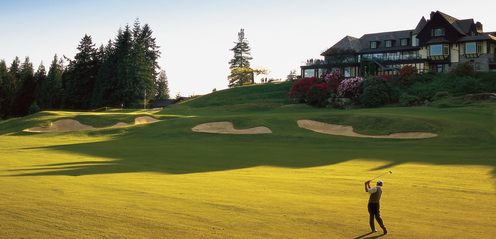

# Capilano Golf and Country Club


Capilano Golf and Country Club (CGCC) is located in the British Properties in West Vancouver, BC. The club officially opened in 1939, although the course opened to the public in the summer of 1937. The club became private in 1955 after being sold to the club members for a price of $825,000. 

```{admonition} World Renowned
:class: attention
In 2018, Capilano was ranked 51st in Golf Digest's "World's 100 Greatest Golf Courses (outside of the US)"
```

Mike first played CGCC as a young teenager in 1964. These early rounds of golf would spark a lifelong passion. The dream of membership was finally realized in 1984. The following year, Mike was the runner up in the prestigious club championship, losing on the 34th hole. This would be his first and only men's club championship final, but success would come in the senior's division. 

Mike's first senior club championship came in 2008 with a come-from-behind win, down one stroke with two holes to play. The prize for this win was a round of golf at Capilano with PGA pro and Master's winner, Mike Weir (a Canadian golf legend). Mike would secure three more senior club championships between 2016 and 2019. Additionally, Mike and his oldest friend and teammate Peter Therien would go on to win six greensome championships at Capilano.

```{dropdown} Course Details and Personal Records

| Detail | Value |
| -  | - | - |  - | - |
| Par | 70 | 
| Rating | 72 | 
| Slope | 135 |
| Distance | 6524 yards |
| Best Score |  65 | 
| Holes in 1 | 4 | 

```

```{epigraph}
“Get your birdies early, because the four finishing holes here are about the toughest you’ll find anywhere. There are three reachable par 5s on the front nine and a couple of short par 4s, and you had better not let that lull you to sleep, because this course has a way of jumping up and grabbing you.”

-- Gerry Chatelain, former Capilano head professional
```


